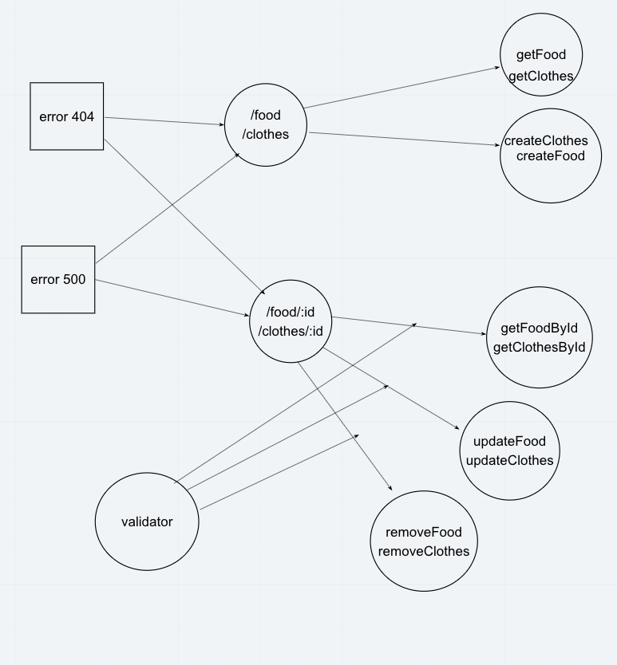

# LAB: Express REST API

Dynamic API Phase 1: Build your core, standards compliant Express server

## Author: Carly Dekock

## [Link to GitHub repository](https://github.com/carlydekock/basic-api-server.git)
## [Link to PR](https://github.com/carlydekock/basic-api-server/pull/1)

## Deployed links

- Link to deployed site on Heroku
- Link to GitHub actions

## The Setup

### How to install

- Clone down repository from GitHub
- Run the command ```npm install``` to install dependencies (dotenv, express, jest, supertest)
- create .env file with PORT variable

### How to test

- Run the command ```npm test``` to test and verify the server is working

### How to run

- Start the server using ```nodemon```
- Visit http://localhost:PORT at the PORT number you've assigned in your .env

## UML


## Credits and Collaborations

- Worked at lab table with Jason Q, Jason D, and Nick M